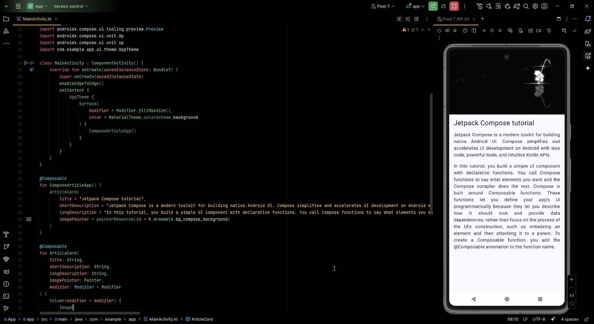

<div align="center">
  
</div>

```
\Android-Basics-with-Compose\Unit 1 Your first Android app\Pathway 3 Build a basic layout\3 Practice Compose Basics
├── README.md
├── java
│   └── com
│       └── example
│           └── app
│               ├── MainActivity.kt
│               └── ui
│                   └── theme
│                       ├── Color.kt
│                       ├── Theme.kt
│                       └── Type.kt
├── res
│   ├── drawable
│   │   ├── bg_compose_background.png
│   │   ├── black.jpg
│   │   ├── ic_launcher_background.xml
│   │   ├── ic_launcher_foreground.xml
│   │   └── placeholder.jpg
│   └── . . .
│
└── screenshot.jpg
```